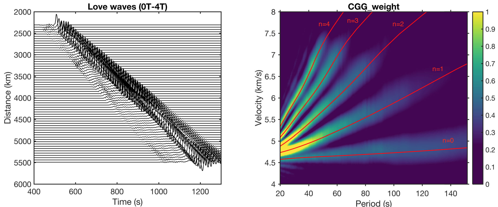

mat-LRTdisp
=========================

This package is largely based off codes written by Ryan Schultz: [Radon-Transform_Schultz-Gu](https://github.com/RyanJamesSchultz/Radon-Transform_Schultz-Gu)

The purpose of this MATLAB package is to extract phase velocity dispersion from multimode surface waves using the Linear Radon Transform (LRT), as demonstrated by Luo et al. (2015). The input is a record section with surface waves windowed in time. The output is a radon panel in the period-phase velocity domain, showing the energy contained in the individual mode branches. The code also includes an interactive tool for picking the maximum peaks corresponding to surface-wave dispersion.

An example synthetic Love wave dataset (fundamental through 4th higher mode) is included in ./pa5_5km/ to demonstrate its application.

**A note about the LRT inversion:**
We include several different methods for solving the Radon Transform inverse problem. In general, the sparser the method (so-called "high resolution LRT" methods), the more sensitive it is to noise in the data. We have found that the most stable results come from the Weighted Conjugate Guided Gradient (CGG) of Ji (2006) (i.e., CGG_weight in our notation), but you are urged to try others:

* **L2**: L2-norm ; *Schultz (2012)*
* **L1**: L1-norm ; *Schultz (2012)*
* **Cauchy**: Cauchy norm ; *Schultz (2012)*
* **CGsimple**: Simple conjugate gradient ; *Ji (2006)*
* **CG_IRLS**: Conjugate gradient with iterative reweighted least squares ; *Ji (2006)*
* **CGG_weight**: Conjugate guided gradient with model and residual weighting **preferred** ; *Ji (2006)*
* **CGhestenes**: Conjugate gradient with an approximation in the descent calculation that is more numerically stable ; *Ji (2006); Claerbout (1992)*

References: 

    Schultz, R., Gu, Y. J., 2012. 
    Flexible, inversion-based Matlab implementation of the Radon transform
    Computers and Geosciences 52, 437-442.
    doi: 10.1016/j.cageo.2012.08.013.

    An, Y., Gu, Y. J., Sacchi, M., 2007. 
    Imaging mantle discontinuities using least-squares Radon transform
    Journal of Geophysical Research 112, B10303.
    doi: 10.1029/2007JB005009.
          
    Ji, J, 2006. 
    CGG method for robust inversion and its application to velocity-stack inversion. 
    Geophysics, 71(4):R59. 
    doi:10.1190/1.2209547

    
    Luo, Y., Yang, Y., Zhao, K., Xu, Y., Xia, J., 2015. 
    Unraveling overtone interferences in Love-wave phase velocity measurements by radon transform. 
    Geophysical Journal International, 203(1):327–333.
    doi: 10.1093/gji/ggv300.